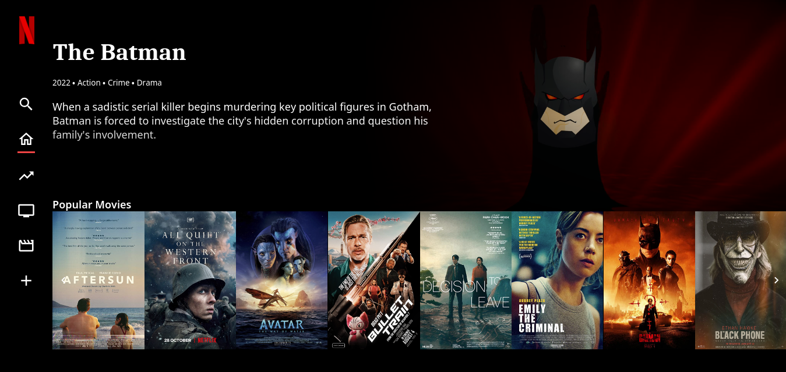

# Netflix Clone


Simple netflix clone created using HTML5, Sass, TailwindCSS, Vue, Pinia and Vue-router.

## Recommended IDE Setup

[VSCode](https://code.visualstudio.com/) + [Volar](https://marketplace.visualstudio.com/items?itemName=Vue.volar) (and disable Vetur) + [TypeScript Vue Plugin (Volar)](https://marketplace.visualstudio.com/items?itemName=Vue.vscode-typescript-vue-plugin).

## Prerequisites

Before you can run this project, you need to have the following installed:

- Node.js (version 18.0 or later)

## Project Setup

To install this project, follow these steps:
Clone the repository using `git`

```
git clone https://github.com/Prakashdeveloper03/Netflix-Clone.git
```

Navigate to the root directory of the project

```
cd <directory_name>
```

Install all required packages

```sh
pnpm install
```

Compile and Hot-Reload for Development

```sh
pnpm dev
```

Type-Check, Compile and Minify for Production

```sh
pnpm build
```

Lint with ESLint

```sh
pnpm lint
```

## Screenshot

